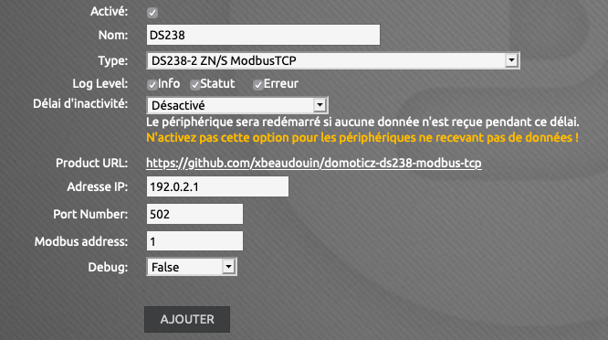
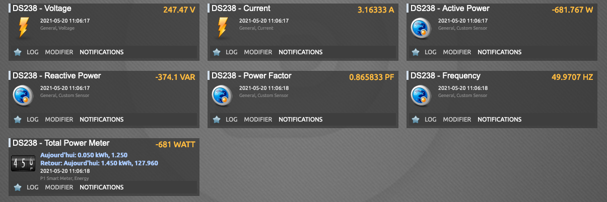
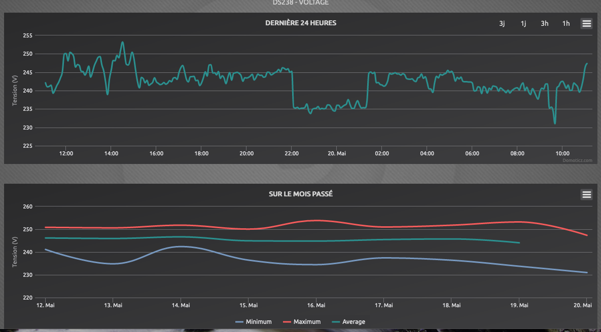
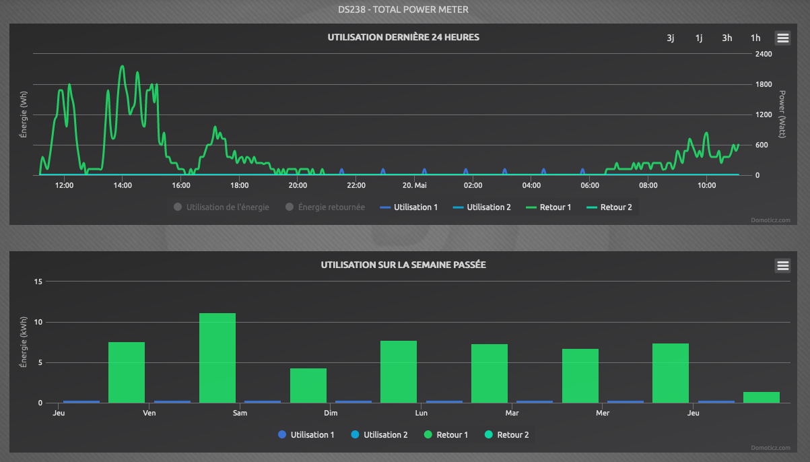

# Domoticz DS238-2 ZN/S ModbusTCP plugin

A Domoticz plugin to collect data from Hiking DS238-2 ZN/S power meter ModbusTCP.

## Requirements

You need the DS238 to be connected over modbus over TCP. Wired or wireless.
Setup that use this on this plugin is using PW21

You need also to find the address of the DS238. You can find it using the
push button. Per default the address is 1.

## Installation of the plugin

This guide is based on Ubuntu 20.04 LTS:

Install `pip3`:

``` shell
sudo apt install python3-pip
```

Install `domoticz`:

``` shell
curl -sSL install.domoticz.com | sudo bash
```

Make sure that the `plugins` folder exists in the `domoticz` folder.

Install the plugin:

``` shell
cd domoticz/plugins
git clone https://github.com/xbeaudouin/domoticz-ds238-modbus-tcp.git
```

Go to the plugin folder and install all required addons:

``` shell
cd domoticz/plugins/domoticz-ds238-modbus-tcp
sudo pip3 install -r requirements.txt
```

Once that is done, restart domoticz:

``` shell
sudo service domoticz.sh restart
```

## Configuration in Domoticz

Once the plugin is installed, a new hardware type will be available: `DS238-2 ZN/S ModbusTCP`.

To add the inverter, go to `Setup` -> `Hardware` and add the counter:

- Enter a `name` for the counter.
- Select `DS238-2 ZN/S ModbusTCP` from the `type` dropdown list.
- Enter the IP address of the PW21 in the `IP Address` field.
- Enter the port number (default: 502) of the PW21 in the `Port Number` field.
- Optionally turn on `Debug`; be aware: this will generate a lot of entries in the Domoticz log!
- `Add` the counter.

This should result in a lot of new devices in the `Setup` -> `Devices` menu.

## Updating the plugin

Go to the plugin folder and get the new verion:

``` shell
cd domoticz/plugins/domoticz-ds238-modbus-tcp
git pull
```

Once that is done, restart domoticz:

``` shell
sudo service domoticz.sh restart
```
## ScreenShots

Hardware page showing a configured PW21 to get data from a DS238-2 ZN/S



The devices page show all Domoticz devices that were created for it.



The voltage graphs.



Total power meter with Return energy (usefull for PV/Wind turbine generators)



## Documentation about the registers used.

This is a copy of : https://gist.github.com/alphp/95e1efe916c0dd6df7156f43dd521d53

### Modbus holding registers:

| Register(s) | Meaning         | Scale Unit | Data format    | R/W |
|-------------|-----------------|------------|----------------|:---:|
| 0000h-0001h | total energy    | 1/100 kWh  | unsigned dword |  R¹ |
| 0002h-0003h | reserved        |            | unsigned dword |     |
| 0004h-0005h | reserved        |            | unsigned dword |     |
| 0006h-0007h | reserved        |            | unsigned dword |     |
| 0008h-0009h | export energy   | 1/100 kWh  | unsigned dword |  R¹ |
| 000Ah-000Bh | import energy   | 1/100 kWh  | unsigned dword |  R¹ |
| 000Ch       | voltage         | 1/10 V     | unsigned word  |  R  |
| 000Dh       | current         | 1/100 A    | unsigned word  |  R  |
| 000Eh       | active power    | 1 W        | signed   word  |  R  |
| 000Fh       | reactive power  | 1 VAr      | unsigned word  |  R  |
| 0010h       | power factor    | 1/1000     | unsigned word  |  R  |
| 0011h       | frequency       | 1/100 Hz   | unsigned word  |  R  |
| 0012h       | reserved        |            | unsigned word  |     |
| 0013h       | reserved        |            | unsigned word  |     |
| 0014h       | reserved        |            | unsigned word  |     |
| 0015h:high  | station address | 1-247      | unsigned char  | R/W |
| 0015h:low   | baud rate       | 1-4²       | unsigned char  | R/W |
| 001Ah       | relay³          |            | unsigned word  | R/W |

#### Notes:

##### Note 1:

Total, export and import energy counters can erased writing 0 in total energy
registers.

##### Note 2:

Value mapping, default 1.

| Value | Baud rate |
|:-----:|:---------:|
| 1     | 9600 Bd   |
| 2     | 4800 Bd   |
| 3     | 2400 Bd   |
| 4     | 1200 Bd   |

##### Note 3:

In DDS238-2 ZN/SR model the relay can be switched by 0x001A register.

| Value | Relay |
|:-----:|:-----:|
|   0   |  Off  |
|   1   |  On   |

##### Data formats

| Data format | Lenght  | Byte order |
|-------------|--------:|------------|
| char        |  8 bits |            |
| word        | 16 bits | Big endian |
| dword       | 32 bits | Big endian |


### Writing registers

The meter does not understand the 'write sigle register' function code (06h),
only the 'write multiple registers' function code (10h).

## Credits

Some part of the code has been taken from SolarEgde Modbus TCP Plugin. Thanks !
https://github.com/addiejanssen/domoticz-solaredge-modbustcp-plugin/

